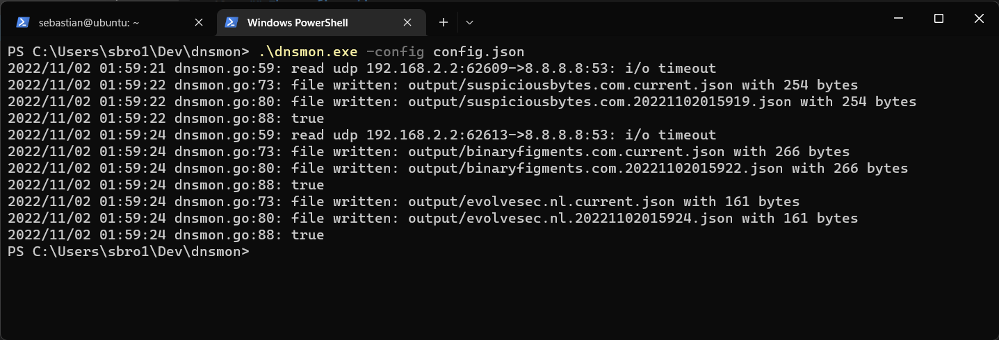

# dnsmon

This `dnsmon` tool get's information about a domainname from DNS, and looks for changes with the previous lookup.

To start with, I only want to look for changes in:

* The serial in the SOA record to see if there was any update
* MX records for mailserver changes
* NS records to see if the nameserver has changed

## Run thit tool

Issue the following command to run this tool.

```bash
dnsmon -config config.yaml
```

## The configuration

Here is an example configuration to use.

```yaml
---
contact: Somebody 
output: output/
resolver1: 8.8.8.8
resolver2: 1.1.1.1
domains:
- name: domainx.com
- name: domainy.com
- name: domainz.nl
```

## Early example run

